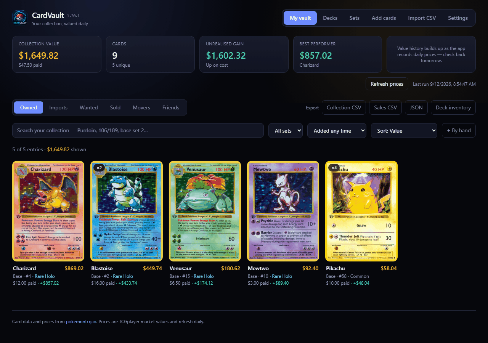
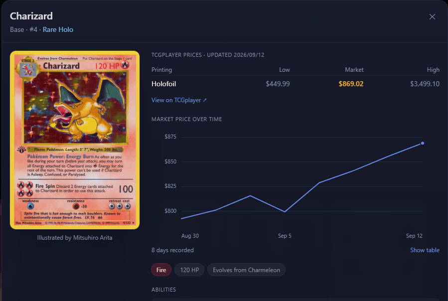
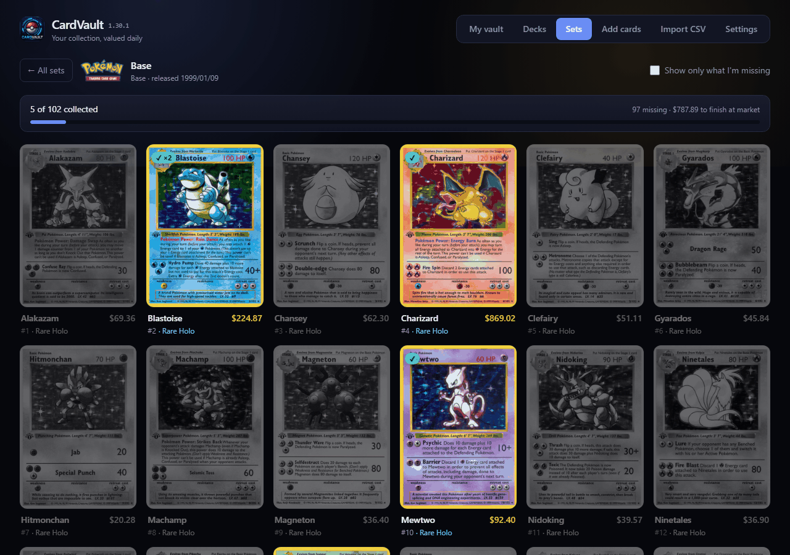

# CardVault

A self-hosted app for browsing, valuing and tracking a Pokémon TCG collection.
Card artwork, set details, attack stats and market prices come from
[pokemontcg.io](https://pokemontcg.io).

[](https://github.com/rhc52980/CardVault/releases/latest)
[](https://github.com/rhc52980/CardVault/releases)
[](https://github.com/rhc52980/CardVault/actions/workflows/ci.yml)
[](LICENSE)




- **ASP.NET Core 10 + SQLite** backend, published as a single self-contained binary
- **React + TypeScript + Tailwind** frontend, built into the server's `wwwroot`
- Runs on Windows, Linux and macOS, and is reachable from a phone on the same wifi

## What it does

- **Search the full catalogue** by name, or with the API's query syntax
  (`set.id:base1 rarity:"Rare Holo"`), and add cards with printing, condition,
  grade, quantity and what you paid.
- **Values your collection** against TCGplayer market prices, including
  unrealised gain against purchase price.
- **Optional password protection**, for when the network isn't fully trusted.
- **Nameable**, so two of these running side by side are easy to tell apart.
- **Tracks where cards physically are**, so the app can tell you not just what you
  own but where to find it.
- **Keeps a want list** with the price you'd pay, and flags cards when the market
  reaches it.
- **Keeps a sold ledger** so profit you actually banked isn't lost when a card
  leaves the collection.
- **Exports everything** as CSV or JSON, so your data is never trapped in here.
- **Handles sealed product and slabs** — things the catalogue can't price, entered
  by hand with your own photo and valuation.
- **Tracks set completion.** Browse all 174 sets with a progress bar each, then
  open one to see the full checklist as a binder page — cards you own in colour,
  everything missing greyed out, with what it would cost to finish.
- **Bulk imports a CSV** of an existing collection, matching each row against the
  catalogue and letting you review every match before anything is saved. Each
  import stays identifiable afterwards, so a batch can be checked over in the vault
  — or removed outright — without touching your sales or price history.
- **Charts each card's price over time**, built from history the app records
  itself.
- **Records its own price history.** The API only ever reports today's price, so
  the app snapshots prices daily into SQLite. After a few days the value trend
  chart fills in — that's data the API cannot give you retroactively.
- **Caches everything locally.** Card metadata goes in SQLite and artwork on disk
  on first fetch, so the collection loads instantly and works offline.

## Where your cards are

Every entry can carry a free-text location — "Binder 3, page 4", "Box A", "Safe
deposit box". Set it when adding a card, or click **Where is it?** on any entry
in the card detail view. It shows on the card tile and is searchable, and a
location dropdown appears in the vault toolbar once anything has one, including
a **No location set** option for finding the stragglers.

Locations come through CSV import too — the column can be called `Location`,
`Storage`, `Binder`, `Box`, `Where`, `Stored` or `Placement` — and are included
in the CSV export.

## Cards that have moved

**My vault → Movers** lists cards whose price has changed enough to be worth knowing
about, biggest effect on your holding first — a £6 rise on eight copies matters more
than £40 on one, and only one of those changes what your collection is worth.

**The threshold is a percentage and an amount, and both must be met.** Either alone is
useless. A percentage on its own fills the page with 50p commons doubling; an amount on
its own calls a 1% wobble on an expensive card news. Asking for 20% *and* £5 catches a
£30 card going to £36 and stays quiet about the rest. Both numbers are yours to set,
along with the window — 7, 30, 90, 180 or 365 days.

Falls are listed alongside rises, on their own tab. The arithmetic is identical, and
"sell before it slides further" is the mirror of the decision a rise informs.

It obeys the same price rules as the vault: the chosen market in its currency, your own
valuations excluded — your estimate rising because you raised it is not news — and
slabs and non-English printings left out, because they have no market price to move.

A card needs two readings before it can have moved at all, and prices are recorded once
a day, so this stays quiet on a new install until some history has built up.

## More than one collection

If more than one person keeps cards here, **Settings → Collections** adds another.
Each gets its own cards, sales, decks, wants, photos and backups, and a dropdown
appears in the header to switch between them. It only appears once there's more than
one, so a household of one never sees it.

Card artwork is shared between collections — it's the same picture whoever asked for
it, and downloading it twice would be waste.

**This separates collections, it doesn't hide them.** One password still gets into all
of them. If you need people genuinely walled off, run a second CardVault with its own
data directory instead — that's stronger isolation than this could offer, and it's a
config change rather than a feature.

The first collection is special in two ways: its files stay exactly where a
single-vault install already put them, so gaining this feature moves nothing; and it
can't be deleted, because a stray click there would take the collection the whole
install exists for.

## Swapping collections with someone

**My vault → Friends.** Export a share file, send it to whoever you trade with, import
theirs. CardVault then shows two lists: cards they have that are on your want list, and
cards they want that you hold a spare of.

**A share file carries no money.** No purchase prices, no valuations, no locations,
notes, photographs or review flags — just which cards, how many, and what condition.
Those fields don't exist on the shared record at all, so the leak isn't filtered out,
it's impossible to write. Hand-entered items are left out too: a sealed box's id means
nothing in anyone else's vault.

**Their vault is stored entirely separately** and never merged with yours. It can't
change what you own, what you're worth, your set completion or your decks, and
removing it is one button.

A file rather than a link, deliberately. Nothing about your server becomes reachable,
there's no URL to leak into a chat window or a screenshot, and it works when the server
is only on your own network. The cost is that a file is a snapshot, which is why the
date they exported it is shown rather than hidden.

"Spare" means owning more than one. The single copy in your binder isn't offered —
giving that up is a decision, not an inventory fact.

## Decks

**Decks** in the top nav. A deck is a list of cards you want to play, which is a
different thing from the cards you own — so it can call for cards you haven't got,
and the useful number it gives you is how many you'd still have to find.

Search the whole catalogue to add a card, set how many copies the list calls for, and
each row shows what you own against what it needs. Pick Standard, Expanded or
Unlimited and the deck is judged against it: cards that aren't legal are called out,
as is being over the four-copy limit or short of sixty cards.

**The rules are reported, never enforced.** A deck of 43 cards with five Pikachu in it
is a deck in progress, and refusing to save it would make this useless for what people
actually do — build towards a list over weeks. Legality comes from the card itself
rather than being hard-coded, so rotation looks after itself.

Two details worth knowing: Basic Energy has no copy limit, so twenty Fire Energy is
fine where twenty Pikachu is not; and a card the API says nothing about has rotated,
which counts as not legal rather than as permission. Two decks may both count on the
same copy — you build one at a time and move cards between them.

## Checking the vault against your scans

If your collection came in by scanning cards and importing the result, the scans keep
improving after the import — OCR gets corrected, a set symbol finally gets identified —
while the vault stays as it was. **My vault → Imports → Check against your scans** takes
the `Batch_N_cards.csv` files and says where the two have drifted apart.

**It corrects nothing.** Disagreements are marked, and the cards keep exactly the
identity they were imported with. A **Needs review** filter appears in the vault
toolbar, flagged cards carry a badge, and each one shows what the scans now read
against what the vault holds. Fix it yourself if the scan is right, dismiss it if the
vault is. Comparing is one button and marking is another, because those are different
decisions.

Nothing records which file an import came from, so each batch is matched to its file
by aligning the two in order — entries are created in the order rows were committed and
the CSVs are sorted by file name, so rows that never imported show up as gaps rather
than throwing everything after them out of step.

**Cards you scanned that never reached the vault** are listed too, and can be
downloaded as a CSV in the importer's own columns — import it and they're added. These
are the rows whose import failed to resolve at the time, plus every row of any file
that matched no import at all. Each carries the scan it came from, so a row you can't
place is still traceable to the image of the actual card.

Between them, every scanned row is accounted for: it agreed, it disagreed, or it isn't
there.

## Photos of your own cards

Off by default. Turn it on in **Settings → Photos of your own cards**, then open any
card in your vault and use **Add a photo of this copy**.

Catalogue artwork shows what a card looks like in general; this is for what *your*
copy looks like — the corner wear you're claiming, the centring, the slab label,
which of two copies is which. It hangs off the entry rather than the card, so two
copies of the same card can carry different photos. PNG, JPEG or WebP, up to 25 MB.

Photos live in their own folder beside your collection, created only once you switch
the feature on. Turning it back off **does not delete anything** — the files stay and
reappear if you switch it on again. Deleting them is a separate button that says so.

**They are not in the automatic backup**, which copies the database alone: full scans
would turn a quick safety copy into a slow one. Keep your originals.

## Finding what you added recently

Every entry records when it arrived, and the vault shows it — "added today", "added
3 days ago", a date once it's older. An **Added** filter in the toolbar offers today,
3, 7, 30 or 90 days, or **Added between…** for a specific range — either end can be
left blank, so "since March" and "up to March" are both answerable without the other
half you don't care about. Picking a window sorts newest first, because that's what
you meant by asking.

The line above the grid then answers the question worth asking: **how many cards
arrived in that window and what they're worth**. Filter to the last 7 days and the
total shown is the value of everything you added this week.

This is the counterpart to the import filter beside it. That one groups cards by the
CSV they came in on, which is no use for a card added one at a time — those belong to
no batch, and the date is the only handle on them.

**Every active filter is named below the count**, each as its own button — click one
to drop it, or **clear all** once more than one is on. Nine different controls can
narrow the grid and several sit off-screen, so a filter you've forgotten about can
otherwise look like a bug: "the vault is stuck showing three cards" is usually a
filter, not a fault, and this is what makes that visible instead of leaving you to
reload the page.

## Editing a lot of cards at once

Hover a card and a **+** appears in its corner; click it to select. Shift-click
another and everything between them on screen goes too, in the order you're
looking at rather than the order they were added. **Select all shown** takes
whatever the current filters have left.

With a selection live, the count line becomes a toolbar: move them all to a
location, set their language, or remove them. The selection is pruned whenever
the filters change, so a card picked under one filter can't be quietly caught by
a removal after you've narrowed to a different set — what you can see is what
you can act on.

There is deliberately **no bulk sell**. A lot sale is one price for the whole
pile, and splitting it back across the cards means inventing a per-card figure
that then feeds realised profit. Sell them individually, or record the lot as a
single hand-entered sale.

## What language a card is

Every entry records the language it was printed in, English unless you say
otherwise. Set it when adding a card or from the dropdown on any entry, and the
same card can sit in your vault in two languages without being treated as a
duplicate — they share a catalogue entry but they are different cards to own.
Anything that isn't English is tagged on the card tile, and a language dropdown
appears in the vault toolbar once you own something that isn't.

**A non-English card has no market price.** TCGplayer and Cardmarket figures both
arrive through the catalogue, which is English-only, and a Japanese card trades in a
different market at a different price. Rather than show you a number from the wrong
market, such a card is left unpriced and stays out of your collection total until
you give it a value of your own, the same way a graded slab or a sealed box does.

Hand-entered items are the exception. They're priced by searching eBay for the name
you gave them, so an item called "Japanese Base Set Charizard" is already being
priced as the Japanese thing it is, and that figure stands whatever language you
set on it.

Set completion still counts a card you own in any language. The catalogue entry is
shared between printings, and a set you filled with Japanese cards is a set you
filled.

## Graded cards

Put a grade on an entry — a company from the dropdown and a number, or free text if
your slab doesn't fit that — and CardVault treats it as the slab it is. The grade is
shown on the tile in place of the condition, and a **Graded only / Raw only** filter
appears in the toolbar once you own one.

**A graded card has no market price either.** Every figure the app holds is for a raw
card, and a slab is worth a multiple of one — occasionally a fraction, for a common in
a cheap grade. There is no honest way to derive the second number from the first, so
the raw price is shown as a reference to judge against and is not counted as what the
slab is worth. Give it a value of your own and it counts normally.

Hand-entered slabs are the exception. They're priced by an eBay search on the name you
typed, so "Base Set Charizard PSA 10" is already a graded price and it stands.

## Want list

Cards you're hunting live under **My vault → Wanted**. Add them from the
**Want** button on any search result, then set the price you'd be willing to
pay.

Because the app already checks prices daily, it can tell you when one comes
down to your number: cards at or below target are pulled to the top of the list,
ringed in green, and counted in a banner. Wanted cards are included in the daily
price refresh for exactly this reason — a target is only useful against a
current price.

**The count follows you.** The Wanted tab carries the number of cards currently
at your price, so a drop is visible from the vault rather than only once you go
looking. Each hit also says how long it has been there — "today", "for 6 days" —
because a drop this morning and one that has sat for a fortnight are different
situations: the first is news, the second is a price you've already decided not
to pay. That clock is worked out after each daily price capture, so it means
when the price actually crossed, not when you next opened the app. It resets if
the price goes back above your target, so it always describes the current run.

When you find one, **Got it** moves it straight into your collection, carrying
the printing across and capturing what you actually paid, then takes it off the
list. Search results badge cards already on the list so you don't add them twice.

## Price charts

Every card's detail view charts its market price over time, one line per
printing, with a crosshair and tooltip reading out all printings at the hovered
date. Printings you own are drawn first. A **show table** toggle lists the same
numbers, so nothing is reachable only by hovering.



A card gets its first price point the moment you add it, rather than waiting for
the next daily cycle — otherwise a card added in the morning would show an empty
chart all day. Until there are two days the chart shows today's figure and says
when the line will start.

**History only goes back as far as you do.** pokemontcg.io publishes today's
price and nothing else, so these charts begin the day a card enters your
collection and get more useful the longer the app runs. There's no way to
backfill.

The chart's four series colours are darker steps of the app's palette, validated
for lightness, chroma, colourblind separation and contrast against the chart
surface rather than picked by eye. A card with more than four priced printings
shows the first four and says so.

## Refreshing prices

Prices refresh automatically once a day. **Refresh prices**, on the dashboard and in
**Settings**, asks for a fresh sweep right now — one API call per card with pacing
between them, so a few thousand cards takes minutes.

When some of those cards already have a price, a second button appears: **Fill in N
missing**, naming the count. It asks only about the cards with no recorded price for
your chosen source — after an import that's the handful that arrived without one,
and it's usually done in seconds rather than minutes. It only shows up when there's a
gap to fill, and disappears again once there isn't.

Some cards may never get a price no matter how often you ask — the API simply has
none for them — and the count can settle above zero rather than reaching it. That's
the source telling you it has nothing, not the app failing to ask.

## Selling, and the sold ledger

When a card sells, use **Sell** on it rather than Remove. Remove deletes it
outright with no record; Sell records what you got and takes it out of the vault.

Enter quantity, sale price each, fees and a date, and the dialog shows the
proceeds and profit before you commit. Selling part of a stack leaves the
remainder in place.

Sold cards live under **My vault → Sold**, with totals for proceeds, realised
profit and cards sold. Once you've sold anything, the stats bar swaps its "best
performer" tile for **realised profit** — money actually banked rather than
paper gains.

Sales where no purchase price was ever recorded count towards proceeds but not
profit, and say so. Treating an unknown cost as zero would report the full sale
price as profit and quietly overstate how well you'd done.

The ledger stores its own copy of the card's details rather than pointing at the
card record, so a sale stays readable even after the thing it refers to is gone —
which matters for hand-entered items, whose synthetic card is cleaned up once
nothing owns it.

Deleting a sale record removes it from history only; it does not put the card
back in your vault.

## Export

Everything can leave the app, from the buttons above the collection:

- **Collection CSV** — spreadsheet-friendly, and the column headers are exactly
  the ones the importer accepts, so an export re-imports cleanly. Computed
  columns (market price, line value, rarity) come along for reading and are
  ignored on the way back in.
- **Sales CSV** — the sold ledger with proceeds and realised profit per sale.
- **JSON** — the complete picture: collection, sales, hand-entered items and
  totals in one file.

Hand-entered items carry ids beginning `custom-` that only mean anything in the
vault that created them, so they won't match if a CSV is imported into a fresh
database. The JSON export keeps their full details regardless.

## Sealed product and graded slabs

These are two different problems, so they have two different answers.

**A slab of a card the catalogue already has.** Add the card normally, set the
grade, then use **Set your own value** on the entry. A PSA 10 bears no relation
to the raw market price, so your figure drives valuation, gains and the
collection total. The detail view still shows the ungraded market price
underneath for reference. Clear the field to go back to tracking market.

**Anything the catalogue doesn't list** — sealed boxes, ETBs, tins, Japanese
promos, error cards. Use **+ By hand** in the vault toolbar. Pick a type (the
form adapts: sealed product has no condition, a slab asks for the grade), give
it a name and a value, and optionally upload a photo or paste an image URL.

Hand-entered items are stored as synthetic cards, so they sort, filter and value
like everything else, and they carry a gold **By hand** badge in the grid. They
are deliberately excluded from two places where they'd be wrong:

- **Daily price refresh** — there's nothing upstream to refresh, so your value stands
- **Set completion** — a sealed box isn't a card in a set, so it can't inflate progress

Deleting the last copy of a hand-entered item removes its synthetic card and its
uploaded photo.

### Your valuations are kept

Every time you set what something is worth, the figure is recorded — so a booster box
you valued at £900 in March and £1,250 now has a line on its chart rather than just a
current number. It shows as **Your valuation** alongside any market series, and it's
what the collection's value-over-time chart uses for that item, matching the grid,
where your figure beats the market.

Recorded once per day, so changing your mind twice in an afternoon is one opinion
rather than three. And it is never read back as a market price: your own estimate
sharing a table with fetched ones must not come out looking like something a market
said.

This matters most for sealed product, which usually has no other price at all —
eBay asking prices need configuring, and nothing else quotes a booster box.

## Searching the catalogue

The search box on **Add cards** reads what you typed rather than assuming everything
is a name, which matters when you're working through a physical stack:

| You type | What it searches |
| --- | --- |
| `charizard` | name |
| `4` | collector number |
| `4/102` | number 4, and the **102** narrows it to sets with that printed total |
| `charizard 4` | name and number together |
| `rarity:"Rare Holo" types:Fire` | passed through as a raw API query |

`4/102` is the useful one — type it exactly as printed on the card and you go
from 20,000-odd cards to about two, because the denominator is the set's printed
total and the API can filter on it directly.

A name that ends in a digit (`Porygon2`) is still treated as a name, and
`Charizard V` isn't split apart. The rules are pinned down in `tests/`.

## Searching your collection

The box above the grid in **My vault** searches what you already own, and understands
the same shapes as the catalogue search:

| You type | What it finds |
| --- | --- |
| `purrloin` | any field — name, set, rarity, location, artist, grade |
| `106` | collector number, exactly — not 14, 24 or 104 |
| `106/189` | number 106; the denominator is accepted but not enforced, since the vault doesn't store printed totals the way the catalogue does |
| `purrloin 106` | every word must match, each free to match a different field |
| `base set 2` | matched as a set name — not as *series*, so a Fossil card (its series is called "Base") never turns up under "base" |

A query is a set of words that must **all** match somewhere on the card, which is
what makes `darkness ablaze 106` and `gastly base` behave the way they read. A bare
number matches the collector number exactly rather than as a substring, because "4"
as a substring would also catch every card numbered 14, 24, 40 through 49, and 104 —
on a real collection, close to a third of it.

## Set completion

The **Sets** tab lists every set with a completion bar. It defaults to sets
you've started; switch to **All** to browse the full catalogue.

Completion is counted two ways, because "complete" means different things:

- **Printed set** (default) — the card numbers printed on the cards themselves
- **Master set** — everything including secret rares, which is why a set can
  show 84 printed but 120 total

Opening a set shows its whole checklist in card-number order. Cards you own are
in full colour with a tick; everything missing is greyed out, so gaps are
obvious at a glance. A **show only what I'm missing** toggle turns it into a
want list, and the header totals what finishing the set would cost at current
market prices. Adding a card from here updates the progress bar immediately.



Set metadata is mirrored into SQLite, so the browser still works when the API is
down. Card details for a set are fetched once and then served from the local
cache — which means prices for cards you *don't* own are from whenever the set
was first opened. Prices for cards you do own stay current via the daily
snapshot.

## CSV import

Drop a file on the **Import CSV** tab, or paste rows directly. Column headers are
matched loosely, so most exports work unmodified — `Card Name`, `card_name` and
`Product Name` all map to the same field. Download a starter template from the
import screen, or see [docs/csv-format.md](docs/csv-format.md) for the full
reference — including how to produce a file from scanned cards.

Include either a **card name** or a **set and number**; everything else is
optional:

| Field | Also accepts |
| --- | --- |
| Name | card name, product name, title |
| Set | set name, edition, expansion |
| Number | card number, collector number, # |
| Quantity | qty, count, copies |
| Variant | printing, finish, foil |
| Condition | cond |
| Language | lang, locale — defaults to English |
| Purchase Price | paid, cost, buy price |
| Purchase Date | acquired, date added |
| Card ID | a pokemontcg.io id such as `base1-4` |
| Location | storage, binder, box, where, stored, placement |
| Notes | note, comment |

**The number leads.** A collector number and its denominator — `106/189` — identify a
card between them, and they're read off a fixed spot on the card, so they're either
right or absent. A name is the thing OCR and hurried typing get wrong. So a name is
used to choose *between* the cards a number found, never to decide whether the number
found anything: `106/189` with a name that's slightly off still matches, where before
the misspelling hid the card and the row went to the network for an answer already
sitting on disk.

A correct name still does its job — it's what separates two cards sharing a number and
a set size.

**A card at a different number is never the answer.** Every other field here degrades
politely: a name matching nothing is ignored rather than allowed to empty the list,
which is right for fields that get misread. The number is the exception, and has to be.
Without that, a precise lookup failing — pokemontcg.io returns 500 often — lets the
search fall through to the card's name alone and match the same Pokémon from a
different set, importing it confidently at the wrong number.

Where a number finds nothing, the row says so and offers what *did* match the name, so
you can pick one deliberately or fix the file. It is never imported for you.

Values are normalised on the way in: `$250.00` becomes 250, `Lightly Played` and
`Excellent` both become `LP`, `Holo` becomes `holofoil`. If a row asks for a
printing the card was never issued in (a reverse holo that doesn't exist), the
import falls back to a real printing and says so.

Where a row could have been more than one card, the candidates are shown **as
pictures**, side by side, with the chosen one ticked — click another to switch,
and the row's artwork and heading follow. These are printings of the same card
with the same name and number, so a list of text says almost nothing; what tells
them apart is the set symbol and the artwork.

A collector number is only unique within a set, and two sets can share a printed
total: `153/189` is both Darkness Ablaze and Astral Radiance. Narrowing picks one
on whatever the file gave it, which may be nothing but a guess at the set, so the
choice is shown rather than made silently.

Rows with only one possible card look exactly as they always did. One candidate
is not an alternative, and a picker offering no choice on every line of a
hundred-row import is worse than none.

Every row lands in one of six states, and **nothing is written to your
collection until you press the button**:

- **Matched** — resolved to exactly one card, ticked and ready
- **Needs a choice** — several cards fit, so pick the right printing from a dropdown
- **Check this one** — the row's card id resolved, but to a card the row's own name
  or number disagrees with. Both readings are shown beside the artwork and the row
  can't be added without a decision
- **Not found** — nothing in the catalogue matched
- **Lookup failed** — the API was unreachable for that row; re-run to retry it
- **Incomplete** — the row had nothing to search on

"Check this one" exists because a card doesn't carry its pokemontcg.io id anywhere
on it. Anything filling in a `Card ID` column is inferring it from the set symbol,
and an inferred id that's wrong is still valid — it resolves to exactly one real
card and would otherwise look every bit as matched as a correct one. Including a
name or number beside the id is what makes that catchable.

Resolution runs as a background job with a progress bar. Rows resolve instantly from
the [offline catalogue](#searching) and from cards you already hold; only what
neither knows about is looked up over the network, one row at a time. With the
catalogue downloaded, a file of cards you've never added before still resolves in
seconds.

The review list stays put after you add cards, with the successful rows ticked off,
so you can work through whatever needed attention and add those too. Anything still
unresolved can be downloaded as a CSV — carrying what your file said rather than
what the import suspected — ready to correct and re-import.

Card artwork in the review list is large by default, because this is the screen
where a card gets checked against its picture. Small and medium are a click away for
skimming a long file, the choice is remembered, and clicking any card opens the
full-size scan — a wrong art variant of the right card is the one mistake the row
text can't describe.

## Reviewing and undoing an import

Importing a scanned collection means committing cards a hundred at a time, and the
mistake that matters is the one you don't notice until later. So an import isn't
just a pile of cards that appeared: it's a **batch** you can find again.

Cards from an import you haven't looked over are ringed in the vault, under a banner
saying what arrived and when:

> **3 cards** imported 15 Aug, 5:10 PM — not checked yet
> · Show only these · Looks right · Remove these

The banner stays until you acknowledge it rather than fading on a timer. The point is
that it survives closing the tab and is still there tomorrow, so a batch can't be
quietly forgotten half-checked. Any import can also be picked from a filter beside
the set and location ones, so "the one from Tuesday" is findable days later —
acknowledged or not.

**Remove these** deletes the cards that import added, and deliberately nothing else:

- **Your sold ledger is untouched.** A sale keeps its own copy of the card it was
  made from and holds no reference back to the entry, so recorded sales and the
  profit computed from them survive. A card sold outright has already left the
  collection, so it isn't there to remove in the first place.
- **Price history is untouched.** It's keyed by card rather than by entry, shared
  with everything else you own, and the one thing here that can't be fetched again.
- **A backup is taken first**, every time, whatever you answer.
- Entries you've **edited or partly sold** since importing are counted and named in
  the confirmation — *"Remove 100, including 3 you've changed"* — so your own
  corrections never disappear without being mentioned.

Cards added by hand belong to no batch, as do any that predate this feature. Neither
is ever flagged as unreviewed or caught by a removal. A batch with nothing left in it
stops being offered, since there's nothing to review or undo.

## Setup

Get a free key from [dev.pokemontcg.io](https://dev.pokemontcg.io) and paste it
into the **Settings** tab. It's stored in your local database, takes effect
immediately, and is only ever displayed back partly masked. The app runs without
a key but is heavily rate limited.

If you'd rather not use the UI, `server/appsettings.Local.json` (gitignored) and
the `POKEMONTCG_API_KEY` environment variable both still work:

```json
{
  "PokemonTcg": {
    "ApiKey": "your-key-from-dev.pokemontcg.io"
  }
}
```

A key saved through the UI takes precedence over both.

**Name your vault** in the same tab, if you like. Whatever you type replaces
"CardVault" in the header and the browser tab, which matters mainly when you run
more than one of these — the tab strip is where you tell them apart. Clearing the
box puts the default back. It's a label and nothing more: the cards, the data
directory and everything on disk are unaffected.

> **The API can't verify keys.** A correct key, a mistyped key and no key at all
> all get an identical 200 response with no rate-limit headers to compare, so
> nothing can tell you a key is genuine — an invalid one is silently treated as
> unauthenticated. Saving only confirms the service answered. If searches feel
> slow or rate-limited, re-check what you pasted.

## Your data and backups

**Your collection is stored outside the application folder**, so updating,
moving or reinstalling the app cannot touch it:

| Platform | Location |
| --- | --- |
| Windows, run directly | `%LOCALAPPDATA%\CardVault` |
| Linux / macOS, run directly | `~/.local/share/CardVault` |
| Installed as a service | pinned by the installer — see **Installing it** |

Override with `CardVault:DataDirectory` in config or the
`CARDVAULT_DATA_DIR` environment variable. The exact path in use is shown on
the Settings tab.

Earlier builds kept the database next to the binary, where replacing the app
folder on update would have destroyed it. If such a collection is found it's
**copied** to the new location on startup — the original is left untouched so
you have a fallback.

Backups are taken automatically:

- **Whenever the app version changes** — the update case, and the one most likely
  to lose data. Taken before anything else touches the database.
- **Once a day** otherwise.
- The ten most recent are kept; older ones are pruned.

They're written with SQLite's backup API rather than copied, because with
write-ahead logging on, the `.db` file alone can be an incomplete picture of a
live database. Back up on demand, download, or delete from the Settings tab.

**To restore one:** stop the app, replace `vault.db` in the data folder with the
backup (renamed to `vault.db`), delete any `vault.db-wal` and `vault.db-shm`
next to it, then start the app again.

## Upgrading from Pokémon Vault

This was called Pokémon Vault until v1.0.0, and the rename moved the service,
install folder and data directory with it. Nothing needs doing by hand: on first
start the app finds an existing collection under the old name and copies it
across, leaving the original in place as a fallback.

If more than one old location exists, the **most recently written** one wins —
an abandoned folder from an earlier build must never quietly replace the
collection you've actually been using.

The old Windows service isn't removed automatically. Once you're happy, tidy up
with `sc.exe delete PokemonVault` (elevated), then delete
`%LOCALAPPDATA%\PokemonVault` and `C:\PokemonVault`.

## Installing it

**Just want to run it?** Download a package from the
[latest release](https://github.com/rhc52980/CardVault/releases/latest), extract
it, and run `CardVault` — the web UI is already built into it, so neither the
.NET SDK nor Node is needed. Then open <http://localhost:5188>.

The installers below do more: they build from source and register it as a
service that starts at boot.

**Windows** — double-click `install\Install-CardVault.bat`. It elevates,
builds the UI and server, installs to `C:\CardVault`, registers a
**CardVault** Windows service and starts it. From then on it runs at boot,
before you log in. `install\Install-DesktopIcon.bat` adds a desktop shortcut.

### Updating

Pull the latest code and run `install\Update-CardVault.bat` (or
`sudo ./linux/install.sh` again). It's the same script as the installer, and it
rebuilds into wherever the service currently points rather than assuming the
default — then refuses to claim success if those two ever diverge.

The running version is shown next to the app name in the header, and in full on
the Settings tab with its build date and source revision. The database is backed
up automatically whenever that version changes, before anything else runs, so an
update can't be the thing that loses your collection.

Settings also has an **opt-in** daily check for new GitHub releases. It's off by
default — nothing leaves the machine unless you turn it on — and it only ever
reads: you get a badge linking to the release, and run the updater yourself.
Bump `<Version>` in `server/CardVault.csproj` when you cut one.

The **Feedback** link at the bottom right of every page opens a new GitHub
issue, pre-filled with your CardVault version and browser. Nothing from your
collection goes into it, nothing is sent until you click it, and you see the
whole form before posting.

**Linux** (Debian/Ubuntu, a Proxmox container, a Pi):

```bash
sudo ./linux/install.sh
```

Builds into `/opt/card-vault`, creates an unprivileged `cardvault` user,
installs a systemd unit and starts it.

Both need the .NET SDK and Node.js on the machine to build.

### Where things go

| | Windows | Linux |
| --- | --- | --- |
| App | `C:\CardVault` | `/opt/card-vault` |
| Collection | `C:\CardVault\data` | `/var/lib/card-vault` |
| Service | `CardVault` | `card-vault` |

The collection is deliberately outside the app folder, so an update replaces the
application without touching your cards.

**Why the installer pins the data directory:** left to its default the app uses
the per-user data folder, and a Windows service account has a *different* one —
the service would come up with an empty collection while yours sat in your
profile. The installer writes an explicit path and copies an existing per-user
collection across on first install, leaving the original as a fallback.

## Running it without installing

```bash
cd client && npm install && npm run build && cd ../server && dotnet run
```

Then open <http://localhost:5188>. For frontend work, Vite's dev server gives
hot reload and proxies `/api` and `/img` to the backend:

```bash
cd client && npm run dev
```

## Password protection

Set a password under **Settings → Password**. Until you do, the app behaves as it
always has — no login, which is fine on a network you trust. Once set, the API
and card images require a session; the page shell stays public because the login
screen has to load.

- Passwords are stored as **PBKDF2-HMAC-SHA256** hashes, 600,000 iterations, with
  a random per-password salt. The password itself is never stored.
- **Sessions live server-side**, so signing out genuinely revokes access rather
  than just discarding the browser's copy — which is what you want when the
  reason you're signing out is a lost phone. Settings lists signed-in devices
  with a **sign out everywhere else** button.
- **Login is rate limited**: five attempts, then an exponential lockout per
  client address. During a lockout even the correct password is refused.
- Changing your password revokes every other session but keeps you signed in on
  the device you changed it from.

**There is no password reset.** Only the hash is stored. If you forget it, clear
the row directly and the app reverts to unprotected:

```bash
sqlite3 "$LOCALAPPDATA/CardVault/vault.db" "DELETE FROM settings WHERE key='auth_password_hash'; DELETE FROM sessions;"
```

## Reaching it from outside your house

**A password is necessary here but nowhere near sufficient.** Two things are
worth being blunt about:

1. **Over plain HTTP your password is sent readable.** On your own network that's
   a minor risk; across the internet it means anyone on the path can take it.
   Anything exposed externally must be HTTPS.
2. **Port-forwarding puts a hand-rolled login in front of the entire internet.**
   The auth here is carefully built, but it is one person's code on a machine in
   your house, and internet-facing services get found by automated scanners
   within hours.

**The approach worth taking is not to expose the port at all:**

- **Tailscale or WireGuard** — a private network between your devices. The app
  stays bound to your LAN and unreachable from the public internet, and your
  phone reaches it as if it were at home. This is the recommended option, and
  Tailscale in particular takes about ten minutes.
- **Cloudflare Tunnel** — outbound-only connection, HTTPS terminated for you, no
  inbound ports and no public IP exposed.

If you do decide to forward a port anyway, at minimum: put a real reverse proxy
(Caddy or nginx) in front with a genuine TLS certificate, keep the password long
and unique, and check the signed-in devices list periodically.

To keep the server local-only while using a VPN, bind it to loopback or your LAN
address:

```bash
ASPNETCORE_URLS=http://127.0.0.1:5188 dotnet run
```

## Data and network notes

- The server binds to `0.0.0.0:5188` so other devices on your network can reach
  it. Set a password (above) if that network isn't fully trusted, and read
  **Reaching it from outside your house** before exposing it any further.
- pokemontcg.io returns intermittent 500/502 errors even on valid requests. The
  client retries transient failures automatically, and upstream outages surface
  as a clear message rather than breaking the page — your saved collection is
  served entirely from local data and is unaffected.

## Adding it to a phone

The app ships a web manifest and an apple-touch-icon, so **Add to Home Screen**
gives you a proper icon and launches without browser chrome — which is the point
if you're using it from the sofa while sorting cards.

Icons and the in-app logo are generated from `brand/CardVault.png` by
`python tools/generate-icons.py` (needs Pillow). That file is the source of
truth — replace it, rerun, and the `.ico`, apple-touch-icon, manifest sizes and
header logo all follow. Everything it writes into `client/public/` is generated;
don't edit those by hand.

Two decisions the script makes deliberately:

- **The `.ico` is cropped to the vault**, not the whole logo. The full artwork
  turns to mush below about 32px — the wordmark and fanned cards are far too
  fine — so browser tabs get a simplified image. That's what multi-resolution
  icons are for.
- **Outputs are palette-reduced to 256 colours.** A full-colour 256px PNG of
  this artwork is ~145KB, which is a lot for something the header loads on every
  page view; quantised it's ~35KB with no visible difference at display size.

## Licence

[MIT](LICENSE) — use it, change it, redistribute it, no obligations.

Card data, artwork and prices come from [pokemontcg.io](https://pokemontcg.io)
and are subject to their terms; Pokémon and all associated names are trademarks
of Nintendo, Creatures Inc. and GAME FREAK Inc. This project isn't affiliated
with or endorsed by any of them.

## Layout

```
server/            ASP.NET Core API + static host
  Data/DataPaths.cs  Resolves the per-user data directory, migrates old installs
  Data/Db.cs       SQLite schema: cards, collection, wants, sales,
                   price_history, sets, sessions, settings, import_batches,
                   plus additive migrations for existing databases
  Services/        API client, card cache, collection, pricing, image cache,
                   daily price snapshots, sets + completion, custom items,
                   CSV parser, import jobs and import batches, want list,
                   sales ledger, export,
                   authentication, settings, backups
  Program.cs       Minimal API endpoints
brand/             Source artwork; everything under client/public/ is generated
                   from it by tools/generate-icons.py
install/           Windows installer/updater, launcher and desktop shortcut
linux/             systemd unit and install.sh
tools/             generate-icons.py — regenerates the raster app icons from
                   the same design as client/public/favicon.svg
tests/             xunit tests (`dotnet test tests`) — the search query parser,
                   where the name-vs-number rules live, and the card-id
                   cross-check that guards CSV imports
docs/              csv-format.md — the import format in full
client/            React frontend (builds into server/wwwroot)
  src/components/  Card grid, search, set browser, detail modal, price chart,
                   stats, CSV import, manual entry, want list, sell + sold
                   ledger, settings
```
